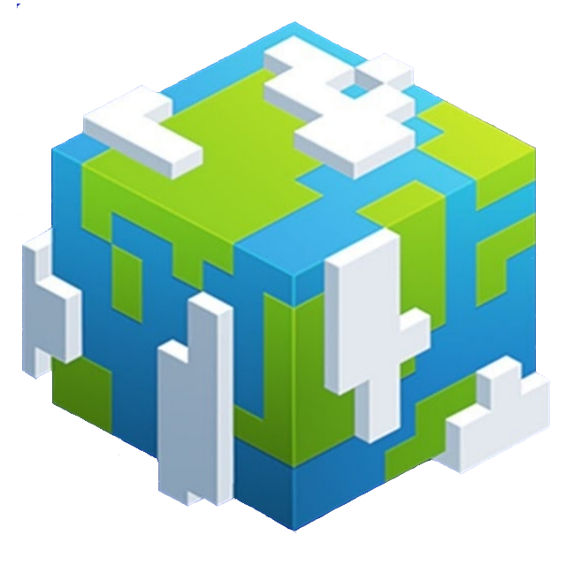

# MagicMC Server

欢迎来到 MagicMC ！我们是一支充满激情的团队，致力于为 Minecraft 玩家们打造更丰富、更令人兴奋的游戏体验。在 MagicMC，我们相信魔法不仅存在于游戏中的奇幻元素，更体现在我们对创意、创新和社区的热爱。

     About us		        

## 我们的团队

MagicMC 是由一群对 Minecraft 充满热情的开发者、设计师和社区管理者组成的团队。我们共享着对游戏的热爱，并齐心协力，不断努力为玩家们带来更多惊喜。

## 我们的目标

MagicMC 的目标是通过开发创新性的 Minecraft 插件、模组以及提供相关资源，为玩家们提供独特且令人难忘的游戏体验。我们致力于创建一个充满活力和友善的社区，让玩家们在 Minecraft 的世界中找到属于他们的魔法之旅。

## 加入我们

如果你对我们的项目感兴趣，欢迎加入 MagicMC 的行列！无论你是有经验的开发者、设计师，还是刚刚入门的爱好者，我们都欢迎你的加入。让我们一起创造魔法般的 Minecraft 世界！

感谢你对 MagicMC 的支持，让我们一同探索 Minecraft 的奇妙世界！
